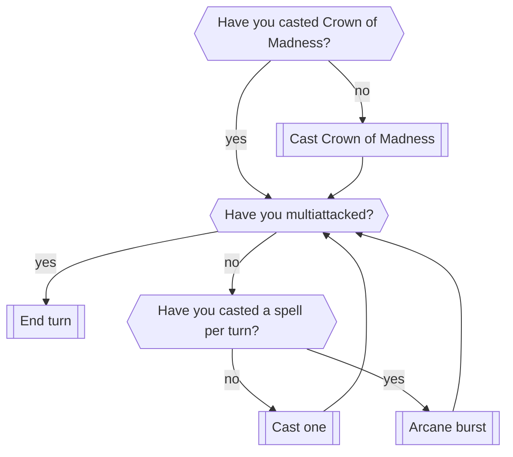

# Champion of Usamigaras - 2 (XP 450; PB +2)

```mermaid
flowchart TD
	castedMadness{{Have you casted Crown of Madness?}} -->|yes|multiAttack{{Have you multiattacked?}}
	castedMadness -->|no|castMad[[Cast Crown of Madness]]
	castMad --> multiAttack
	multiAttack -->|yes|exit[[End turn]]
	multiAttack -->|no|spells{{Have you casted a spell per turn?}}
	spells -->|no|cast[[Cast one]]
	cast --> multiAttack
	spells -->|yes|aB[[Arcane burst]]
	aB --> multiAttack
```
