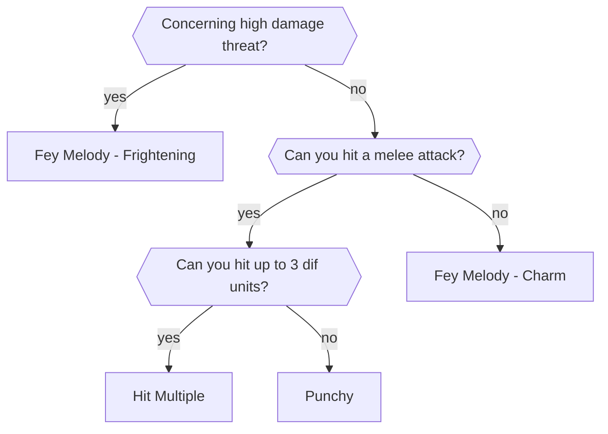

# Satyr Revelmaster - 6 (XP 2,300; PB +3)

```mermaid
flowchart TD
	bigBad{{Concerning high damage threat?}} -->|yes|FMF[Fey Melody - Frightening]
	bigBad -->|no|inMelee{{Can you hit a melee attack?}}
		inMelee -->|yes|multiMelee{{Can you hit up to 3 dif units?}}
			multiMelee -->|yes|HM[Hit Multiple]
			multiMelee -->|no|HS[Punchy]
		inMelee -->|no|FMC[Fey Melody - Charm]
```
