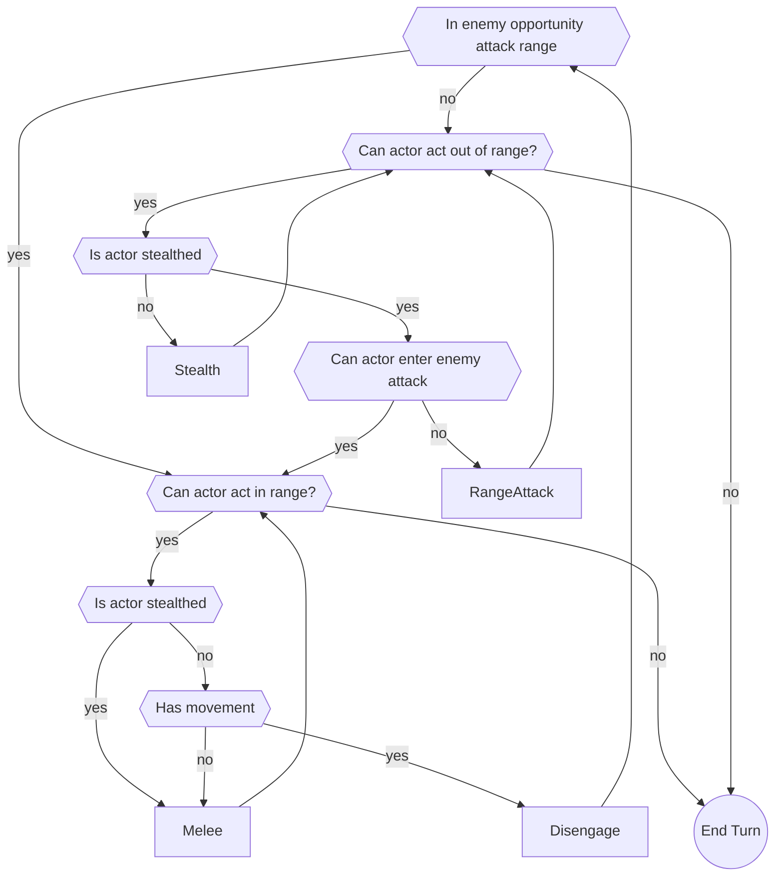

# Spy - 1 (XP 200; PB +2)

```mermaid
flowchart TB
	oppAttack{{In enemy opportunity attack range}} 
	oppAttack -->|yes|aaInRange{{Can actor act in range?}}
		aaInRange -->|yes|isStealthedIR{{Is actor stealthed}}
			isStealthedIR -->|yes|Melee
				Melee --> aaInRange
			isStealthedIR -->|no|canMoveIR{{Has movement}}
				canMoveIR -->|yes|Disengage
				Disengage --> oppAttack
				canMoveIR -->|no|Melee
		aaInRange ---->|no|exit((End Turn))
	oppAttack -->|no|aaOutRange{{Can actor act out of range?}}
		aaOutRange -->|yes|isStealthedOR{{Is actor stealthed}}
			isStealthedOR -->|yes|enterOppAttack{{Can actor enter enemy attack}}
				enterOppAttack -->|yes|aaInRange
				enterOppAttack -->|no|RangeAttack
				RangeAttack --> aaOutRange
			isStealthedOR -->|no|Stealth
				Stealth -->aaOutRange
		aaOutRange ---->|no|exit
```

