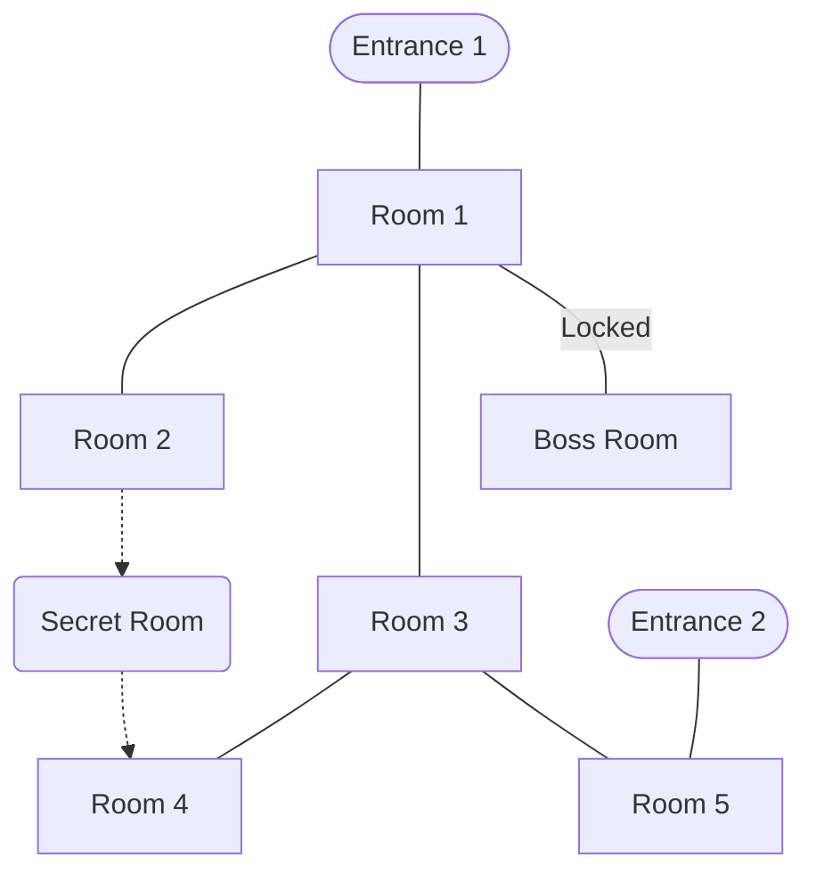

---
tags:
  - dungeon
---
> {{title}} - Theme

# Build a Dungeon Checklist
- [ ] Entrance 1
- [ ] Entrance 2
- [ ] Main Hub
- [ ] Mini Boss
- [ ] Secret Area
- [ ] Locked Door
- [ ] Boss Arena
- [ ] Treasure Room
## Flowchart
```mermaid
flowchart TD
```
### Example



# Rooms

| ID  | Room          | Lighting | Mood | Descriptor | Notes |
| --- | ------------- | -------- | ---- | ---------- | ----- |
|     | Entrance 1    |          |      |            |       |
|     | Entrance 2    |          |      |            |       |
|     | Main Hub      |          |      |            |       |
|     | Mini Boss     |          |      |            |       |
|     | Secret Area   |          |      |            |       |
|     | Locked Door   |          |      |            |       |
|     | Boss Arena    |          |      |            |       |
|     | Treasure Room |          |      |            |       |

# Battle map

